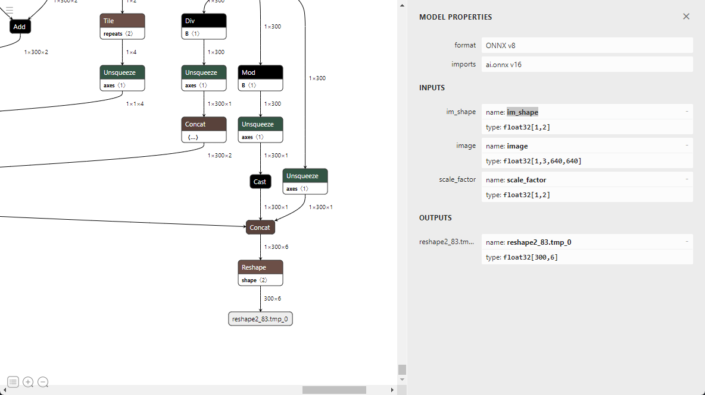

# RT-DETR Deploy with ONNX and TensorRT


base on project https://github.com/PaddlePaddle/PaddleDetection/tree/develop/configs/rtdetr

**not need NMS not need Anchors and soeasy post process**

## 1.Clone project 
```shell
git clone https://github.com/PaddlePaddle/PaddleDetection.git
```

## 2.Export paddlepaddle model
```shell
cd PaddleDetection/
python tools/export_model.py -c configs/rtdetr/rtdetr_hgnetv2_l_6x_coco.yml -o weights=https://bj.bcebos.com/v1/paddledet/models/rtdetr_hgnetv2_l_6x_coco.pdparams trt=True --output_dir=output_inference
```
note: need paddlepaddle python package >= 2.4.0

## 3.Convert paddlepaddle model to onnx model
```shell
paddle2onnx --model_dir=./output_inference/rtdetr_hgnetv2_l_6x_coco/ --model_filename model.pdmodel  --params_filename model.pdiparams --opset_version 16 --save_file rtdetr_hgnetv2_l_6x_coco.onnx
```

## 4.Simplify onnx model
```shell
onnxsim  rtdetr_hgnetv2_l_6x_coco.onnx rtdetr_hgnetv2_l_6x_coco-sim.onnx --overwrite-input-shape im_shape:1,2 image:1,3,640,640 scale_factor:1,2
```



## 5.ONNX infer with simplified model
```shell
python 1.onnx_run_original_onnx_post_process.py
```
and will generate a result.jpg

## 6.Modify onnx model to only one input
simplified model has three inputs (im_shape, image, scale_factor),but we want only one input of model.
use script modify onnx model
```shell
python modify_onnx.py -i rtdetr_hgnetv2_l_6x_coco-sim.onnx -o rtdetr_hgnetv2_l_6x_coco-modify.onnx
```


## 7.ONNX infer with modified model
```shell
python 2.onnx_run_modify_onnx_no_post_process.py
```

## 8.Generate TensorRT engine
for supporting `GatherND` and `GridSample` op need TensorRT version >= 8.5
* GatherND    TensorRT >= 8.4
* GridSample  TensorRT >= 8.5

```shell
trtexec --onnx=rtdetr_hgnetv2_l_6x_coco-modify.onnx --saveEngine=rtdetr_hgnetv2_l_6x_coco-modify-fp32.engine
```
